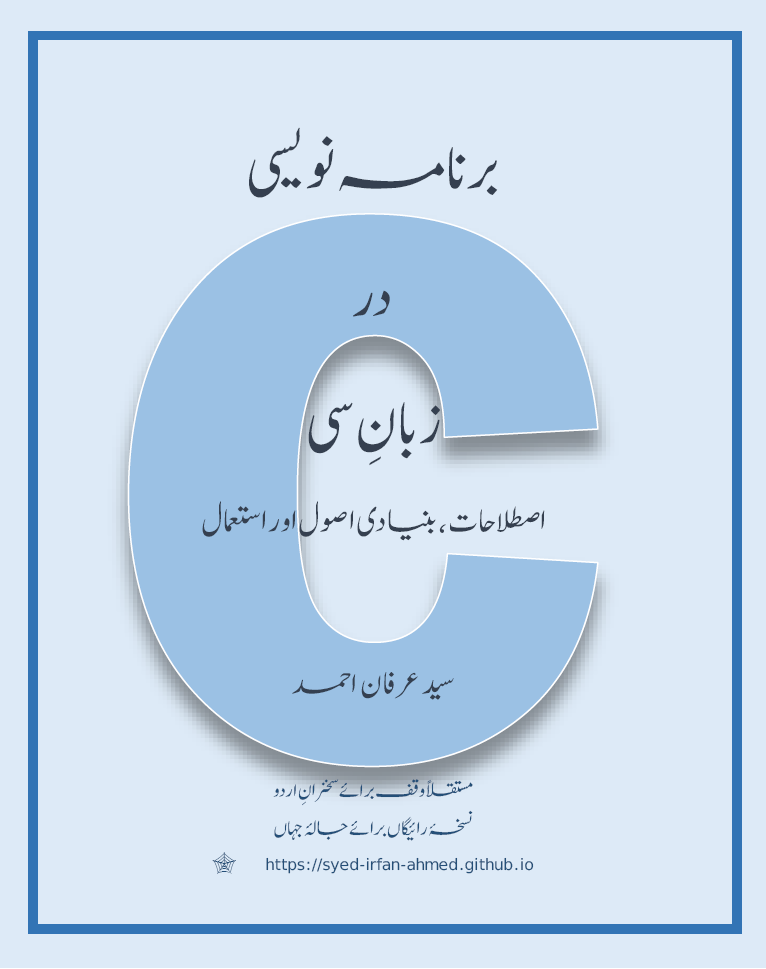

# C Language Book (Urdu web edition)
Forever free web edition for the basic C language Urdu book (600+ pages)

Purpose: To help Urdu speakers acquire the C-language with text in their native language.

برنامہ نویسی در زبان سی، اصطلاحات، بنیادی اصول اور استعمال

