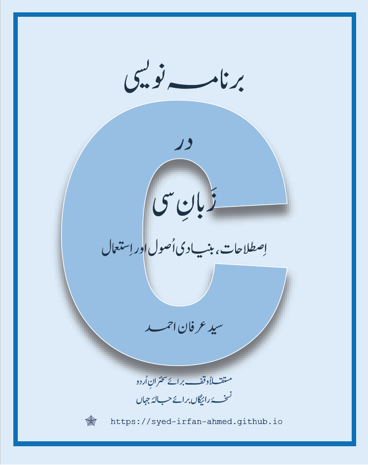

# Urdu_Books_Web_Editions
Free web editions for technical books written in Urdu
1) Basic C language Urdu book (600+ pages)

Purpose: To help Urdu speakers acquire the C-language with text in their native language.

برنامہ نویسی در زبان سی، اصطلاحات، بنیادی اصول اور استعمال

